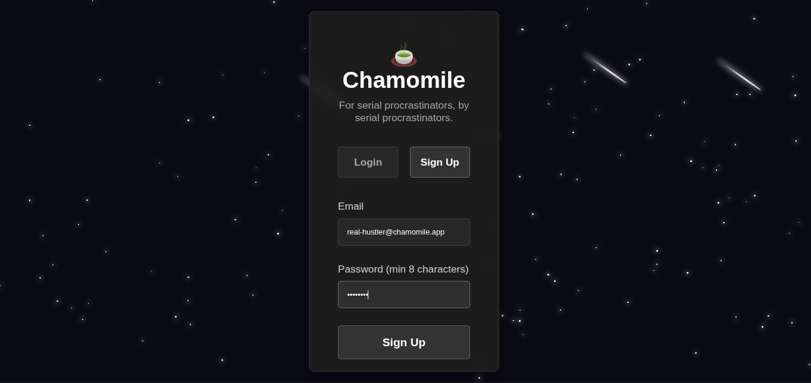
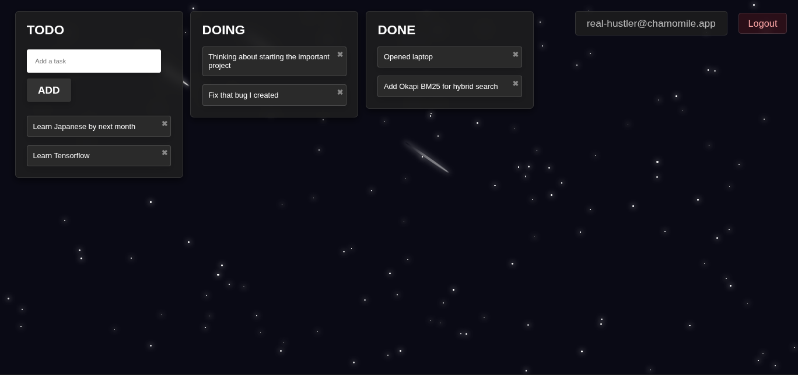

# 🍵 Chamomile

A step up on my previous kanban board project with user authentication, persistent database and type safety. Built with TypeScript, Express and SQLite.





## ✨ Features

- 🔐 **Secure Authentication** - JWT-based auth with bcrypt password hashing
- 🤖 **Anti-Bot Protection** - Honeypot fields and timing analysis
- 💾 **Persistent Storage** - SQLite database with automatic backups
- 🚀 **Type-Safe** - Full TypeScript backend with compile-time safety
- 📱 **Responsive** - Works on desktop, tablet, and mobile, with smooth drag-and-drop

## 🏗️ Tech Stack

**Backend:**
- TypeScript + Express
- SQLite (better-sqlite3)
- JWT authentication
- bcrypt password hashing
- express-rate-limit for DDoS protection

**Frontend:**
- Vanilla JavaScript (no frameworks)
- HTML5 drag-and-drop API
- CSS3 animations
- LocalStorage for token persistence

## 📦 Installation

### Prerequisites
- Node.js 18+ 
- npm or yarn

### Setup

1. **Clone the repository**
```bash
git clone https://github.com/TDJR007/Chamomile.git
cd chamomile
```

2. **Install dependencies**
```bash
npm install
```

3. **Configure environment variables**
```bash
cp .env.sample .env
```

Edit `.env` and set your values:
```env
PORT=3000
JWT_SECRET=your_super_secret_jwt_key_change_this_in_production
DB_FILE=./data/chamomile.db
NODE_ENV=development
```

⚠️ **IMPORTANT:** Change `JWT_SECRET` to a strong random string in production!

4. **Initialize the database**
```bash
npm run db:init
```

5. **Start the development server**
```bash
npm run dev
```

6. **Open your browser**
```
http://localhost:3000
```

## 🚀 Production Deployment

### Build for production
```bash
npm run build
```

This compiles TypeScript to JavaScript in the `dist/` folder.

### Start production server
```bash
NODE_ENV=production npm start
```

### Environment Variables for Production

Make sure to set these in your production environment:

- `PORT` - Server port (default: 3000)
- `JWT_SECRET` - **MUST be a strong random string**
- `DB_FILE` - Path to SQLite database file
- `NODE_ENV` - Set to `production`

## 📁 Project Structure
```
chamomile/
├── public/              # Frontend files
│   ├── index.html       # Main kanban board
│   ├── auth.html        # Login/signup page
│   ├── auth.js          # Auth logic
│   ├── api.js           # API wrapper
│   ├── drag.js          # Drag-and-drop
│   ├── todo.js          # Task creation
│   ├── utils.js         # Helper functions
│   ├── storage.js       # Data loading
│   ├── star-background.js
│   └── styles.css
│
├── src/                 # TypeScript backend
│   ├── types/           # Type definitions
│   ├── middleware/      # Auth & security middleware
│   ├── routes/          # API routes
│   ├── utils/           # Utilities (JWT, bcrypt, validation)
│   ├── db/              # Database layer
│   ├── app.ts           # Express app setup
│   └── server.ts        # Entry point
│
├── data/                # SQLite database
│   └── chamomile.db
│
├── dist/                # Compiled JavaScript (after build)
│
├── .env                 # Environment variables (not in git)
├── .env.sample          # Template for .env
└── package.json         # Node.js project’s metadata, scripts, and dependencies.
└── package-lock.json    # Locks the exact versions of installed dependencies to ensure reproducibility
└── tsconfig.json
└── chamomile.rest       # Contains HTTP request definitions used for testing
```

## 🔒 Security Features

### Authentication
- JWT tokens with 7-day expiration
- Bcrypt password hashing (10 rounds)
- Passwords must be 8+ characters

### CORS Configuration
- **Same-origin policy:** Our app uses `origin: true` which reflects the request origin; this works because frontend and backend share the same domain.
- This is more secure than `origin: '*'` (allows everything) and simpler than whitelisting specific domains.

### Anti-Bot Protection
- **Honeypot field** - Hidden form field that bots auto-fill
- **Timing analysis** - Detects forms filled too quickly
- **Rate limiting:**
  - Signup: 3 attempts per 24 hours
  - Login: 10 attempts per 15 minutes
  - API: 100 requests per 15 minutes

### Database Security
- SQL injection protection via prepared statements
- Foreign key constraints with CASCADE deletion
- User data isolation (users can only access their own tasks)

## 🧪 API Testing

Use the included `chamomile.rest` file with VS Code's REST Client extension:

1. Install [REST Client extension](https://marketplace.visualstudio.com/items?itemName=humao.rest-client)
2. Open `chamomile.rest`
3. Update the `@token` variable after logging in
4. Click "Send Request" above any endpoint

Or use curl:
```bash
# Register
curl -X POST http://localhost:3000/api/auth/register \
  -H "Content-Type: application/json" \
  -d '{"email":"test@example.com","password":"password123","timestamp":'$(date +%s)000'}'

# Login
curl -X POST http://localhost:3000/api/auth/login \
  -H "Content-Type: application/json" \
  -d '{"email":"test@example.com","password":"password123"}'

# Get tasks (replace YOUR_TOKEN)
curl http://localhost:3000/api/todos \
  -H "Authorization: Bearer YOUR_TOKEN"
```

## 📝 API Endpoints

### Authentication
- `POST /api/auth/register` - Create new user
- `POST /api/auth/login` - Login and get JWT token

### Tasks (All require authentication)
- `GET /api/todos` - Get all tasks
- `POST /api/todos` - Create new task
- `PUT /api/todos/:id` - Update task
- `DELETE /api/todos/:id` - Delete task

## 🐛 Troubleshooting

**Server won't start:**
- Check that port 3000 isn't already in use
- Verify `.env` file exists and has valid values
- Run `npm run db:init` to ensure database is initialized

**"Invalid token" errors:**
- Token may have expired (7-day limit)
- Log out and log back in to get a new token
- Check that `JWT_SECRET` is set in `.env`

**Tasks not persisting:**
- Check `data/` folder exists and is writable
- Verify database file was created: `ls data/chamomile.db`
- Check server logs for database errors

---

## Steps to Deploy on Railway

### **Step 1: Push to GitHub (if not done already)**

```bash
# Initialize git (if not done)
git init
git add .
git commit -m "Initial commit - Chamomile kanban board"

# Create GitHub repo, then:
git remote add origin https://github.com/yourusername/chamomile.git
git branch -M main
git push -u origin main
```

---

### **Step 2: Create `railway.json`** (optional but recommended)

Create this in your project root for better control:

```json
{
  "$schema": "https://railway.app/railway.schema.json",
  "build": {
    "builder": "NIXPACKS"
  },
  "deploy": {
    "startCommand": "npm start",
    "restartPolicyType": "ON_FAILURE",
    "restartPolicyMaxRetries": 10
  }
}
```

---

### **Step 3: Add Railway-specific build config**

Railway auto-detects Node.js apps, but let's be explicit.

**Create `nixpacks.toml`** in project root:

```toml
[phases.setup]
nixPkgs = ['nodejs_20']

[phases.install]
cmds = ['npm ci']

[phases.build]
cmds = ['npm run build']

[start]
cmd = 'npm start'
```

This tells Railway exactly how to build your app (uses Node 20, installs deps, builds TypeScript, runs production server).

---

### **Step 4: Sign up on Railway**

1. Go to: https://railway.app
2. Click **"Login"** → **Sign up with GitHub** (easiest way)
3. Authorize Railway to access your repos

You'll get **$5 free credit** immediately (no CC needed yet).

---

### **Step 5: Create a New Project**

1. Click **"New Project"**
2. Select **"Deploy from GitHub repo"**
3. Choose your **chamomile** repository
4. Railway will auto-detect it's a Node.js app and start deploying

---

### **Step 6: Add Environment Variables**

Once the initial deploy starts:

1. Click on your service (should say "chamomile" or similar)
2. Go to **"Variables"** tab
3. Add these variables:

```
NODE_ENV=production
PORT=3000
DB_FILE=/app/data/chamomile.db
JWT_SECRET=<click "Generate" button or paste your own>
```

**For JWT_SECRET:** Railway has a "Generate" button that creates a secure random string. Use that!

---

### **Step 7: Add Persistent Volume for SQLite**

This is CRITICAL - without this, your database resets on every deploy!

1. Under your Project, go to **"Architecture"** tab
2. Right click on your service and click **"Attach Volumes"**
3. Under **"Create Volume"**
4. Set:
   - **Mount Path:** `/app/data`
   - **Size:** 1 GB (more than enough)
5. Click **"Add"**

Railway will redeploy automatically after adding the volume.

---

### **Step 8: Ensure data directory exists**

Update `src/db/database.ts` to create the directory if it doesn't exist:

```typescript
import Database from 'better-sqlite3';
import path from 'path';
import fs from 'fs';
import dotenv from 'dotenv';
import { User, Task, TaskStatus } from '../types';

// Load environment variables
dotenv.config();

const dbPath = process.env.DB_FILE || './data/chamomile.db';

// Ensure data directory exists (important for Railway/production)
const dbDir = path.dirname(dbPath);
if (!fs.existsSync(dbDir)) {
  fs.mkdirSync(dbDir, { recursive: true });
  console.log(`📁 Created data directory: ${dbDir}`);
}

const db = new Database(dbPath);

// Enable foreign keys (CRITICAL for CASCADE deletion)
db.pragma('foreign_keys = ON');

console.log(`📦 Database connected: ${path.resolve(dbPath)}`);

// ... rest stays the same
```

Commit and push this change:

```bash
git add .
git commit -m "Ensure data directory exists for production"
git push
```

Railway will auto-deploy the update.

---

### **Step 9: Get Your URL**

1. In Railway dashboard, click on your service
2. Go to **"Settings"** → **"Networking"**
3. Click **"Generate Domain"**

You'll get something like:
```
https://chamomile-production-abc123.up.railway.app
```

Copy that URL and visit it! 🎉

---

### **Step 10: Test Everything**

1. Visit your Railway URL
2. Sign up for an account
3. Create some tasks
4. Drag them around
5. **Refresh the page** - data should persist!
6. Log out and log back in - should still work!

---

## 🔧 Railway-Specific Commands

### View Logs (Real-time)
```bash
# Install Railway CLI (optional but useful)
npm i -g @railway/cli

# Login
railway login

# Link to your project
railway link

# View logs
railway logs
```

Or just view logs in the Railway dashboard: **Service → Deployments → Click latest deploy → View Logs**

---

### Redeploy Manually
In Railway dashboard:
1. Go to **Deployments**
2. Click **"Redeploy"** on latest deployment

Or push to GitHub (auto-deploys).

---

### Check Resource Usage
Railway dashboard → **Metrics** tab

You'll see:
- CPU usage
- Memory usage
- Network bandwidth
- **Estimated cost** (should be ~$3-4/month)

---

## 📊 Monitoring Your Credit

Check your usage:
1. Railway dashboard → **Account Settings** → **Usage**
2. You'll see current month's usage
3. Breakdown by project/service

**Pro tip:** Set up a notification when you hit $4 (Settings → Notifications).

---

## 🛑 If You Run Out of Credit

Railway will:
1. Email you when you hit 80% of credit
2. Pause services when credit hits $0
3. You can add a card to continue (only charges what you use)

But realistically, **$5 covers this app easily**. You'd need to get significant traffic to burn through it.

---

## 📄 License

MIT License - feel free to use this for personal or commercial projects!

## 🙏 Acknowledgments

Built with Claude, TypeScript, and way too much coffee ☕

---
